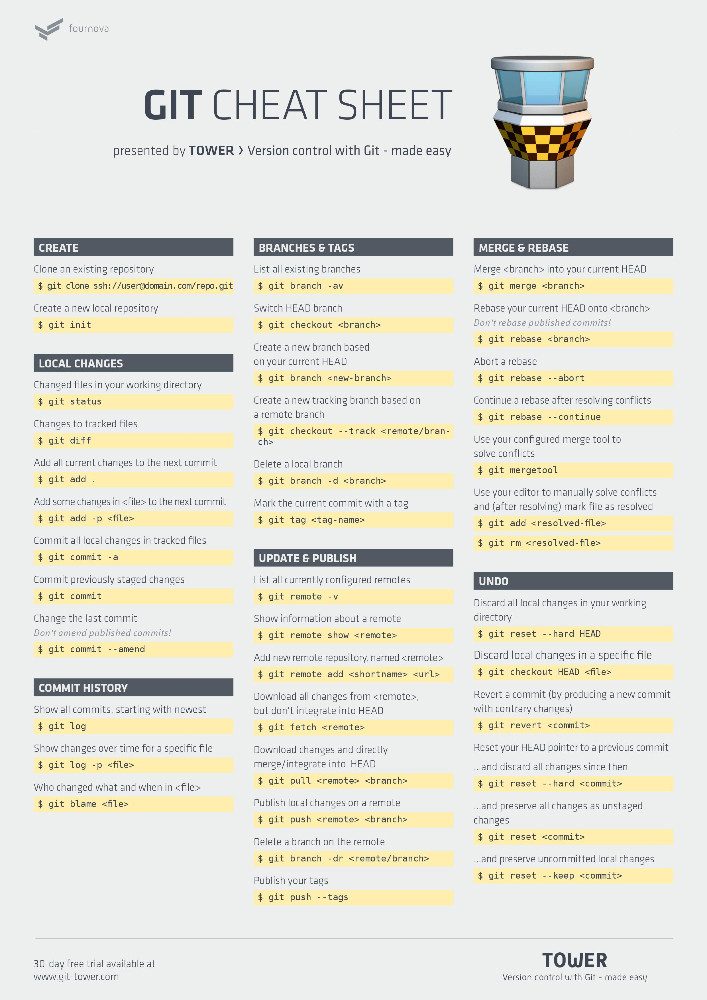

# Правила контроля версий

## Новые разработки

Привести активный рабочий репозиторий в актуальное состояние

```bash
git checkout **develop**   
git status   
git pull origin **develop**
```   

Создать ветку, начиная с последнего актуального состояния рабочей ветки
```bash
git checkout -b **newBranchName**
```

После релиза ветку следует удалять
```bash
git branch -D **oldBranchName**
git push origin --delete **oldBranchName**
```

*Больше одной разработки с одной ветки ревью не пройдут.*

## Коммиты

Коммитить следует каждую логически завершённую часть задачи.

Комиты содержат валидную информацию о ходе разработки в человекочитаемом виде
```bash
git add EventErrofFile.file
git commit -a -m 'Event error in property loop fixed with handle certain error'
```

## Пуш

Перед тем, как запушить что-либо в репозиторий, следует сначала подтянуть последние изменеия и решить конфликты.   
*Даже если вы думаете, что у вас актуальное состояние. Это не так.*
```bash
git pull origin **develop**
```

Законченная разработка должна быть отправлена на общий сервер.
```bash
git push origin **newBranchName**
```

## Пулл-реквесты

После окончания разработки нужно произвести пулл-реквест на основную ветку.

Разницу между своими коммитами следует обязательно посмотреть коммандой diff или на bitbacket.
```bash
git diff --stat HEAD~0..HEAD~1
```

*Без пулл-реквеста разработки не принимаются*


## Если что-то пошло не так

Любое измененение в файле можно откатить до последнего коммита
```bash
git checkout **unlikelyFile**
```

Если чт-то пошло совершенно нет так, можно стереть изменения до выбранного коммита.
```bash
git reset ---hard HEAD
# или 
git reset --hard **commitHash**
```


## Команды, которые должен знать каждый


